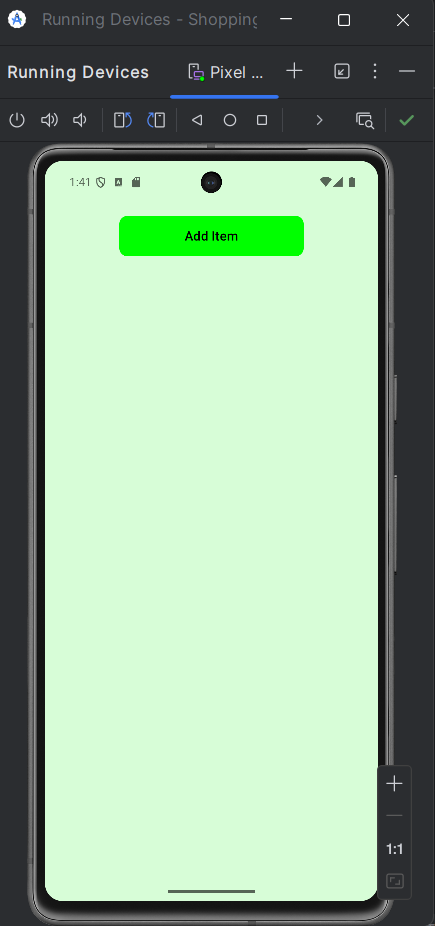
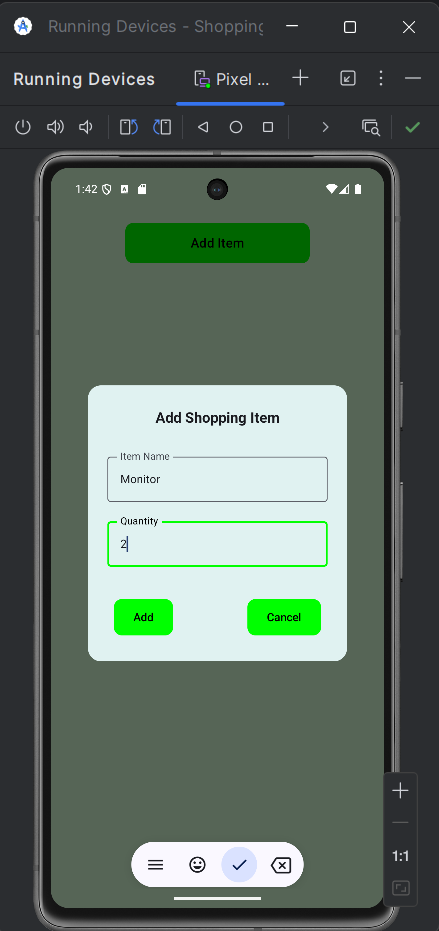
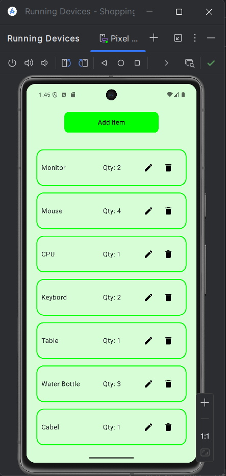
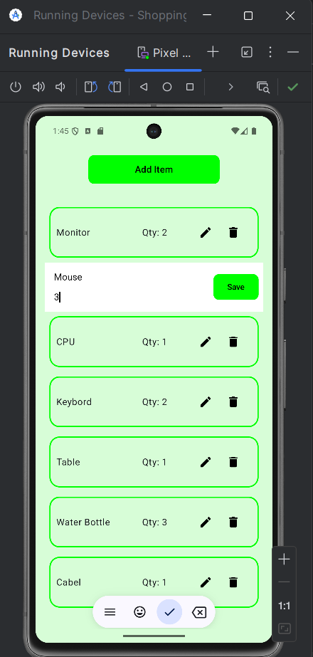

<h1>🛒 Shopping List App (Jetpack Compose)</h1>

A simple Shopping List Android app built with <b>Kotlin</b> and <b>Jetpack Compose</b>. Users can add, edit, and delete shopping items with a clean, modern UI and custom color palette.

<h2>📱 Tech Stack</h2>
<ul>
  <li><b>Language:</b> Kotlin</li>
  <li><b>Framework:</b> Android Jetpack Compose</li>
  <li><b>IDE:</b> Android Studio</li>
  <li><b>Version Control:</b> Git & GitHub</li>
</ul>

<h2>✨ Features</h2>
<ul>
  <li>Add new shopping items with name and quantity</li>
  <li>Edit existing items inline within the list</li>
  <li>Delete items from the shopping list</li>
  <li>Clean and modern UI with green-themed button styling</li>
  <li>Custom-designed Alert Dialog for item addition</li>
  <li>Dynamic list rendering with LazyColumn</li>
  <li>Consistent button sizes, rounded corners, and color themes</li>
  <li>Responsive layout for all screen sizes</li>
</ul>

<h2>📖 App Flow</h2>
<ol>
  <li>User lands on the home screen with an <b>Add Item</b> button.</li>
  <li>On clicking <b>Add Item</b>, a custom Alert Dialog appears to enter item name and quantity.</li>
  <li>The added items appear in a styled LazyColumn with options to <b>Edit</b> or <b>Delete</b>.</li>
  <li>Clicking <b>Edit</b> allows inline editing, and <b>Save</b> updates the item details.</li>
  <li>Clicking <b>Delete</b> removes the item from the list.</li>
</ol>

<h2>🖥️ Screenshots</h2>

<!-- First row: landscape Code + Output -->

  

 

<!-- Second row: 4 portrait screenshots in a single line -->

  
  
  
  

<h2>📦 How to Run</h2>
<ol>
  <li>Clone this repository: <code>git clone [your-repo-link]</code></li>
  <li>Open the project in <b>Android Studio</b></li>
  <li>Run the app on an emulator or physical device</li>
</ol>

<h2>📌 Author</h2>

<b>Siddhant Kudale (SID)</b>

